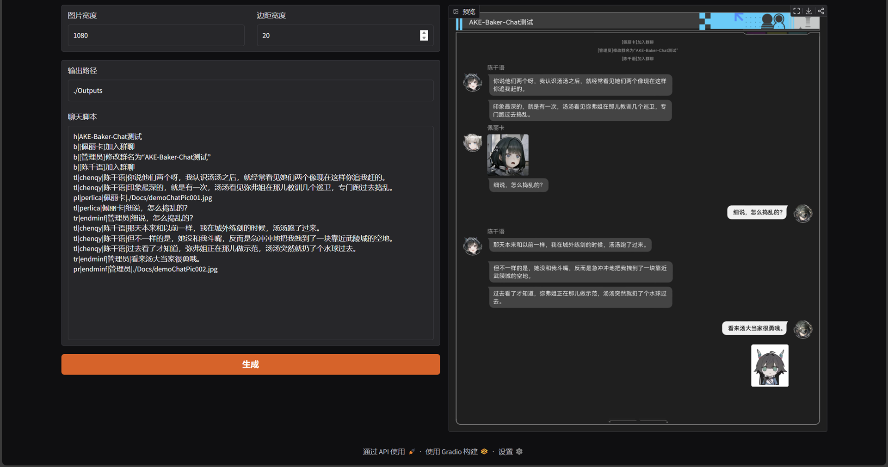
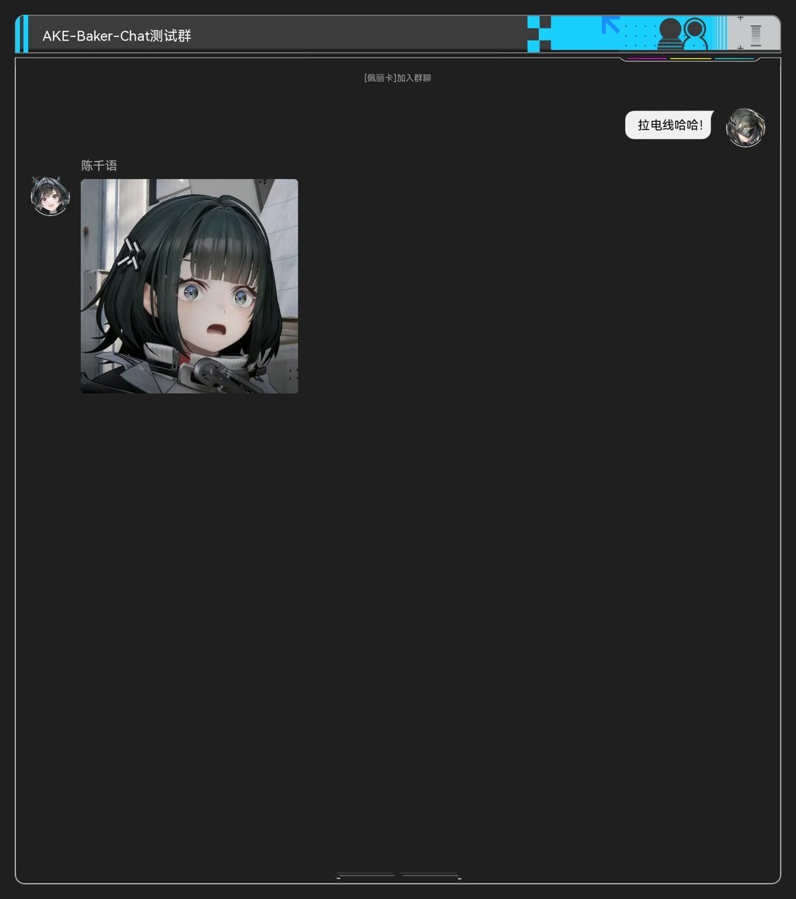

# AKE Baker Chat

《明日方舟：终末地》Baker聊天生成器

## 安装与运行

- 下载[软件包](https://github.com/xwVoid114514/AKE-Baker-Chat/archive/refs/heads/main.zip)并解压，建议解压至全英文目录。
- 双击运行“安装环境.bat”，等待安装完成。
- 双击运行“运行.bat”，程序会自动打开浏览器界面，若未能打开，请手动打开浏览器并访问 http://127.0.0.1:7860/

## 功能介绍

- 支持自定义标题栏、横幅消息、文本和图片聊天消息
- 内置游戏内干员头像，也可自定义发言人头像和昵称
- 脚本化自动生成

<!-- markdownlint-disable -->

<!-- markdownlint-restore -->

## 使用说明

### 脚本格式

- **设置标题栏**
`h|<标题>`
`<标题>` - 要展示的标题栏文本
例：`h|AKE-Baker-Chat测试群`
&nbsp;

- **添加横幅消息**
`b|<消息>`
`<消息>` - 要展示的横幅消息文本
例：`b|[佩丽卡]加入群聊`
&nbsp;

- **添加文本消息**
左侧：`tl|<ID>|<昵称>|<消息>`
右侧：`tr|<ID>|<昵称>|<消息>`
`<ID>` - 发言人ID，用于关联头像文件
`<昵称>` - 发言人昵称，将会展示于聊天中
`<消息>` - 发言人发送的文本消息（不可以包含`|`字符）
例：`tr|endminf|管理员|拉电线哈哈！`

\* *注：连续多条消息为同一发言人时，仅有第一条会显示发言人头像与昵称*

&nbsp;

- **添加图片消息**
左侧：`pl|<ID>|<昵称>|<图片路径>`
右侧：`pr|<ID>|<昵称>|<图片路径>`
`<ID>` - 发言人ID，用于关联头像文件
`<昵称>` - 发言人昵称，将会展示于聊天中
`<图片路径>` - 发送的图片路径，若使用相对路径，则相对于程序根目录（即`运行.bat`所在目录）
例：`pl|chenqy|陈千语|./ChatPic/pic001.jpg`
\* *注：连续多条消息为同一发言人时，仅有第一条会显示发言人头像与昵称*

&nbsp;
<!-- markdownlint-disable -->

以上示例脚本运行结果

<!-- markdownlint-restore -->
  
&nbsp;

### 自定义头像

- 支持自定义发言人头像，头像文件需位于`./Resources/Avatar`目录下。
- 头像文件命名格式为`avt_XXX.png`，例如`avt_chenqy.png`。
- 脚本中调用头像时，请将`XXX`填入`<ID>`字段。
